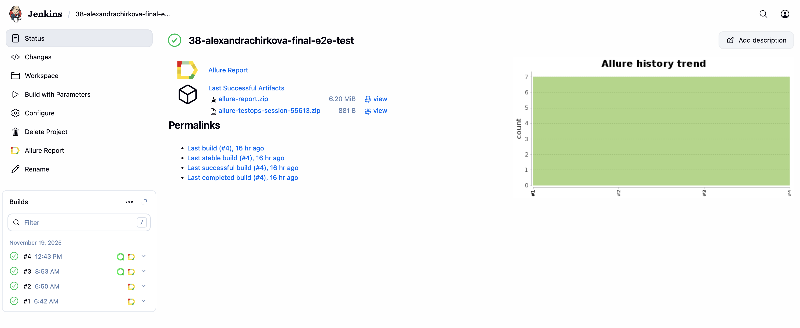
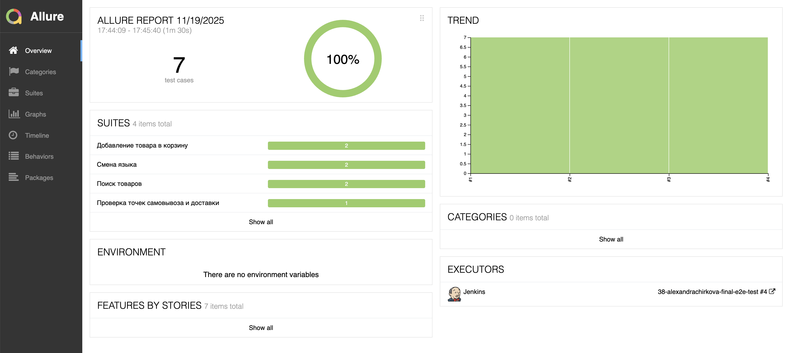
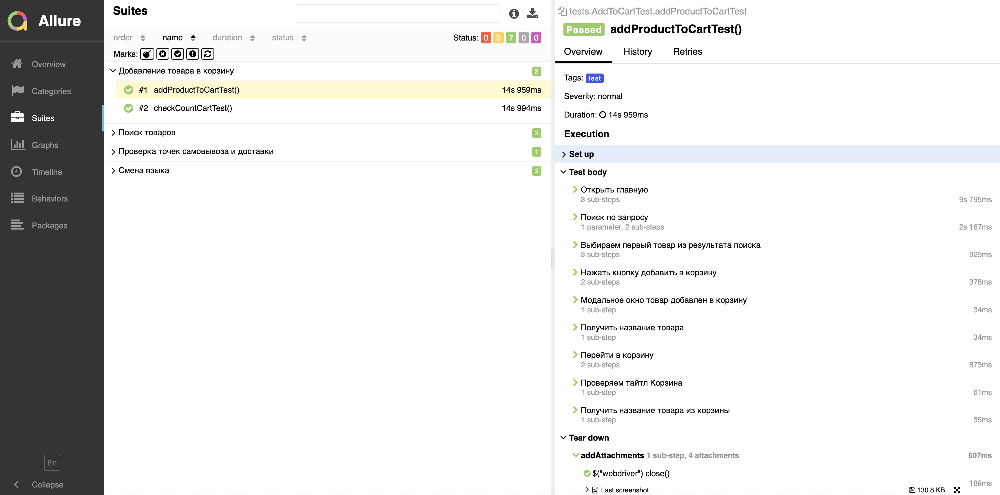
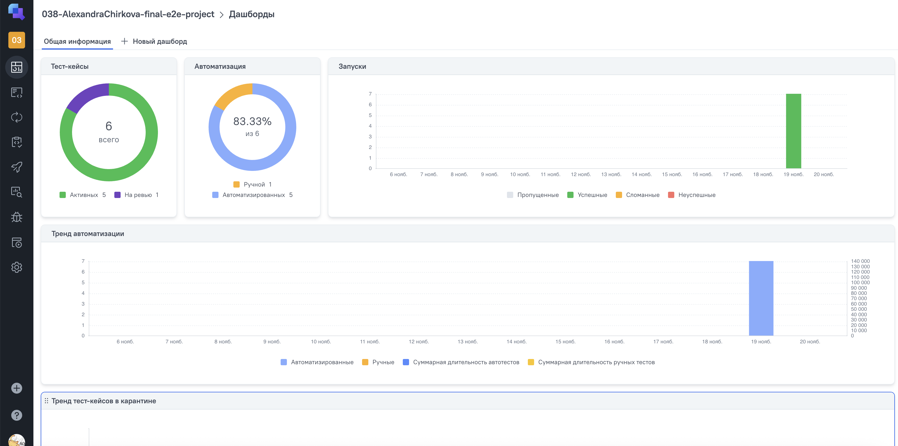
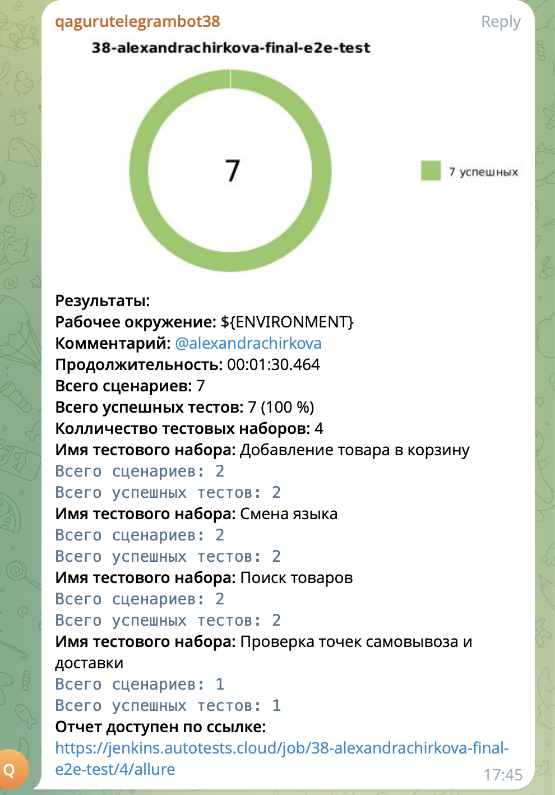

#  Проект по автоматизации тестирования [flip.kz](https://www.flip.kz/)
> Flip.kz — крупный казахстанский интернет-магазин с широким ассортиментом товаров: от книг, электроники и косметики до товаров для дома, канцелярии и детских товаров. 
> Платформа известна собственной быстрой доставкой, удобным мобильным приложением и выгодными предложениями по акциям и бонусной программе.
> Flip обеспечивает простой поиск, подробные описания товаров и удобный процесс заказа, что делает его одним из самых популярных маркетплейсов в Казахстане.
---

## Содержание:
---

- [Технологии и инструменты](#технологии-и-инструменты)
- [Примеры автоматизированных тест-кейсов](#примеры-автоматизированных-тест-кейсов)
- [Сборка в Jenkins](#параметры-сборки-в-jenkins)
- [Запуск из терминала](#запуск-из-терминала)
- [Allure отчет](#allure-отчет)
- [Интеграция с Allure TestOps ](#интеграция-с-allure-testops)
- [Уведомление в Telegram при помощи бота](#уведомление-в-telegram-при-помощи-бота)
---

## Технологии и инструменты:
---

   
   
   
   
   
    
    
    
   
   
   
    

---

## Примеры автоматизированных тест-кейсов:

- ✓ Проверка работы поиска
- ✓ По клику на 'KZ' сайт переводится на казахский язык
- ✓ Проверка добавление в корзину
- ✓ Проверка каунтера корзины
- ✓ Прооверка пунктов самовывоза

---

## 🔧 Сборка в [Jenkins](https://jenkins.autotests.cloud/job/38-alexandrachirkova-final-e2e-test/)

---

## Параметры сборки в Jenkins
- **browser** — браузер (по умолчанию: `chrome`)
- **browserVersion** — версия браузера (по умолчанию: `128.0`)
- **browserSize** — размер окна браузера (по умолчанию: `1920x1080`)
- **remoteUrl** — логин/пароль + адрес удалённого Selenoid

---

## Запуск из терминала

<h3>Локальный запуск:</h3>

<pre>
gradle clean demoqa_test
</pre>

<h3>Удалённый запуск через Jenkins:</h3>

<pre>
clean demoqa_test
"-Dbrowser=${BROWSER} "
"-DbrowserVersion=${BROWSER_VERSION}"
"-DbrowserSize=${BROWSER_SIZE}"
"-Dremote=https://user1:1234@${REMOTE}/wd/hub"
</pre>

---

## [Allure](https://jenkins.autotests.cloud/job/38-alexandrachirkova-final-e2e-test/5/allure/) отчет
---

---

## Интеграция с [Allure TestOps](https://allure.autotests.cloud/project/5013/dashboards)
---

---

## Уведомление в Telegram при помощи бота

---

---

## Видео примера запуска тестов в Selenoid

В отчетах Allure для каждого теста прикреплен не только скриншот, но и видео прохождения теста

  

---

